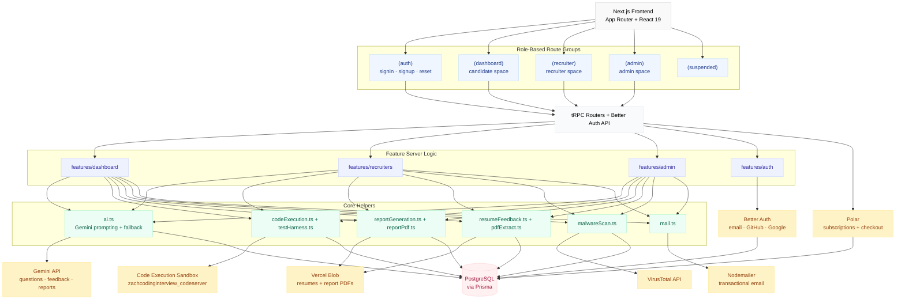
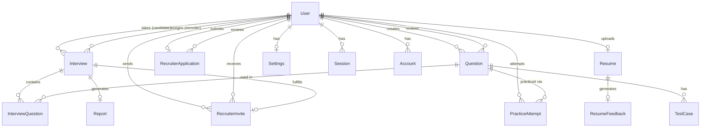

<div align="center">


### AI-Powered Mock Interview & Recruiter Platform

Practice coding, behavioral, system design, and resume-based interviews against a real AI interviewer - then get a full report, verdict, and PDF at the end. Recruiters can post real questions, invite real candidates, and review real results.

<p align="center">
  <a href="https://zachcodinginterview.vercel.app">Website</a>
  ·
  <a href="https://github.com/19akshansh/zachcodinginterview/issues">Report Bug</a>
  ·
  <a href="https://github.com/19akshansh/zachcodinginterview/issues">Request Feature</a>
</p>

<p align="center">
  
  
  
  
</p>

<p align="center">
  
  
  
  
  
  
  
  
</p>

</div>

---

## 🚀 What is ZachCodingInterview?

ZachCodingInterview is a full-stack mock interview platform. A candidate signs up, picks an interview type - Coding, Behavioral, System Design, Resume-Based, or Domain-Specific - dials in a seniority level and company tier, and sits a real, timed interview against an AI interviewer. Code gets executed and graded against real test cases in a sandboxed runner, and every interview ends with an AI-generated report, verdict, and downloadable PDF.

It isn't just a practice tool, though. There's a full **recruiter side**: recruiters apply for verified access, get approved by an admin, submit their own interview questions for review, send direct invites to candidates, and read the reports on how those candidates actually performed. An **admin panel** sits on top to manage users, approve recruiter applications, and moderate submitted questions.

This project is hand-built, not vibe-coded - the schema, the route architecture, the auth flows, the billing integration, and the code execution pipeline were all designed and iterated on by hand (the full history is in `prisma/migrations`, one deliberate change at a time).

---

## ✨ Features

**Interview Engine**

- 5 interview types: Coding, Behavioral, System Design, Resume-Based, Domain-Specific
- Seniority-aware (Entry → Principal) and company-tier-aware (Startup / Mid-Market / FAANG) question generation
- Live, timed sessions with a per-interview time limit
- AI-generated final report with strengths, weaknesses, suggestions, and a hire/no-hire style verdict

**Code Execution**

- Real test cases run against a sandboxed execution service (JavaScript & Python)
- Pass / fail / runtime error / time-limit-exceeded verdicts per test case
- Language-aware test harness that wraps candidate submissions before execution

**Practice Mode**

- Standalone LeetCode-style practice bank, separate from full mock interviews
- Public, hidden, and custom test case visibility per question
- Built-in hints per question

**Resume Tools**

- Upload a resume → parsed automatically → AI-generated resume feedback (ATS score, strengths, weaknesses, suggestions)
- Resume content can feed directly into resume-based interview questions
- Resumes are scanned through VirusTotal before they're ever trusted

**Recruiter Workspace**

- Apply for recruiter access → admin review → approve/reject
- Submit original interview questions for approval
- Send direct interview invites to any candidate by email
- Review candidate reports and make hire decisions

**Admin Dashboard**

- Manage users and roles
- Approve or reject recruiter applications
- Approve or reject community-submitted questions

**Auth & Billing**

- Email/password + GitHub OAuth + Google OAuth via Better Auth
- Forgot / reset password flows
- Free and Pro tiers via Polar, with in-app upgrade prompts and subscription-aware gating

**Reports & Storage**

- Interview reports and resume feedback rendered to PDF (`@react-pdf/renderer`)
- Files stored in Vercel Blob
- Rate limiting on sensitive endpoints

---

## 🏗️ Architecture



## 🔄 How an Interview Works

```mermaid
graph LR
    Step1[1. Pick Type<br/>Coding · Behavioral · System Design<br/>Resume-Based · Domain-Specific]
    Step2[2. Set Difficulty<br/>Seniority + company tier]
    Step3[3. AI Generates Questions<br/>Gemini, seniority-aware]
    Step4[4. Candidate Attempts<br/>Code runs in sandbox / answers recorded]
    Step5[5. Grading<br/>Test cases + AI evaluation]
    Step6[6. Report Generated<br/>Verdict, strengths, weaknesses, PDF]
    Step7[7. Recruiter Review<br/>if invited by a recruiter]

    Step1 --> Step2
    Step2 --> Step3
    Step3 --> Step4
    Step4 --> Step5
    Step5 --> Step6
    Step6 --> Step7

    classDef s1 fill:#eff6ff,stroke:#bfdbfe,color:#1e3a8a
    classDef s2 fill:#eef2ff,stroke:#c7d2fe,color:#3730a3
    classDef s3 fill:#fff1f2,stroke:#fecdd3,color:#9f1239
    classDef s4 fill:#fef3c7,stroke:#fde68a,color:#92400e
    classDef s5 fill:#fdf4ff,stroke:#f3e8ff,color:#6b21a8
    classDef s6 fill:#ecfdf5,stroke:#a7f3d0,color:#065f46
    classDef s7 fill:#f0fdf4,stroke:#bbf7d0,color:#166534

    class Step1 s1
    class Step2 s2
    class Step3 s3
    class Step4 s4
    class Step5 s5
    class Step6 s6
    class Step7 s7
```



## 🗃️ Data Model



---

## 🛠️ Tech Stack

| Layer            | Technology                                                                                                      |
| ---------------- | --------------------------------------------------------------------------------------------------------------- |
| Frontend         | Next.js 16 (App Router), React 19, TypeScript, Tailwind CSS v4                                                  |
| Components       | shadcn/ui, Radix UI, Monaco Editor                                                                              |
| API              | tRPC v11, TanStack Query                                                                                        |
| Database         | PostgreSQL, Prisma ORM                                                                                          |
| Auth             | Better Auth, GitHub OAuth, Google OAuth                                                                         |
| AI               | Google Gemini via Vercel AI SDK (`@ai-sdk/google`, `ai`)                                                        |
| Code Execution   | Custom sandbox - [zachcodinginterview_codeserver](https://github.com/19akshansh/zachcodinginterview_codeserver) |
| File Storage     | Vercel Blob                                                                                                     |
| Malware Scanning | VirusTotal API                                                                                                  |
| Billing          | Polar                                                                                                           |
| Email            | Nodemailer                                                                                                      |
| PDF Generation   | `@react-pdf/renderer`                                                                                           |
| Linting          | Biome                                                                                                           |

---

## 🚀 Quick Start

### Clone the repository

```bash
git clone https://github.com/19akshansh/zachcodinginterview.git
cd zachcodinginterview
```

### Install dependencies

```bash
npm install
```

### Configure environment variables

Copy the example file and fill in your own values:

```bash
cp example.env .env
```

See [Environment Variables](#-environment-variables) below for what each one does.

### Set up the database

```bash
npm run db:generate
npm run db:migrate
```

### Start the development server

```bash
npm run dev
```

### Other useful scripts

```bash
npm run build       # production build
npm run lint         # biome check
npm run format        # biome format --write
npm run db:studio     # open Prisma Studio
npm run db:reset      # reset the database
```

---

## 🔑 Environment Variables

All variables are documented in [`example.env`](./example.env). Copy it to `.env` and fill in your own values.

| Variable                                                             | Description                                                                                                     | Required                 |
| -------------------------------------------------------------------- | --------------------------------------------------------------------------------------------------------------- | ------------------------ |
| `NEXT_PUBLIC_APP_URL`                                                | Public URL of your deployment                                                                                   | Yes                      |
| `DATABASE_URL`                                                       | PostgreSQL connection string                                                                                    | Yes                      |
| `BETTER_AUTH_SECRET`                                                 | Secret key for Better Auth sessions                                                                             | Yes                      |
| `BETTER_AUTH_URL`                                                    | Base URL for auth callbacks                                                                                     | Yes                      |
| `GITHUB_CLIENT_ID` / `GITHUB_CLIENT_SECRET`                          | GitHub OAuth                                                                                                    | No (for GitHub sign-in)  |
| `GOOGLE_CLIENT_ID` / `GOOGLE_CLIENT_SECRET`                          | Google OAuth                                                                                                    | No (for Google sign-in)  |
| `EMAIL_USER` / `EMAIL_PASS` / `EMAIL_FROM`                           | Nodemailer transactional email (verification, invites, etc.)                                                    | Yes                      |
| `POLAR_ACCESS_TOKEN` / `POLAR_SERVER`                                | Polar API access token and environment (`sandbox` or `production`)                                              | Yes                      |
| `NEXT_PUBLIC_POLAR_PRO_PRODUCT_ID` / `POLAR_PRO_PRODUCT_ID`          | Polar Pro product ID                                                                                            | Yes                      |
| `POLAR_SUCCESS_URL`                                                  | Redirect URL after a successful checkout                                                                        | Yes                      |
| `CODESERVER_API_URL` / `CODESERVER_APIKEY` / `CODESERVER_TIMEOUT_MS` | The code execution sandbox - see [shout-out](#-code-execution--powered-by-zachcodinginterview_codeserver) below | Yes (for code execution) |
| `BLOB_READ_WRITE_TOKEN`                                              | Vercel Blob storage for resumes & report PDFs                                                                   | Yes                      |
| `GEMINI_API_KEY`                                                     | Fallback AI key - as of v0.9.6 users can bring their own key in-app                                             | No                       |
| `VIRUSTOTAL_API_KEY` / `VIRUSTOTAL_BASE`                             | Malware scanning for uploaded resumes                                                                           | Yes                      |

---

## 📂 Project Structure

```text
zachcodinginterview/
├── prisma/
│   ├── schema.prisma        # 15 models: User, Interview, Question, Report, Resume...
│   └── migrations/          # full migration history - this schema evolved over time
├── public/
│   └── mainAssets/
│       ├── logo.svg
│       └── logoFull.svg     # the logo at the top of this README
├── src/
│   ├── app/                  # Next.js App Router - grouped by access level
│   │   ├── (auth)/           # signin, signup, forgot/reset password
│   │   ├── (dashboard)/      # candidate space: interviews, practice, resume, reports, profile
│   │   ├── (recruiter)/      # recruiter space: review, invites, question submissions
│   │   ├── (admin)/          # admin space: users, applications, question moderation
│   │   ├── (suspended)/      # shown to suspended/banned accounts
│   │   └── api/              # tRPC + Better Auth route handlers
│   ├── features/              # feature-sliced UI + server logic, mirrors the app/ groups
│   │   ├── dashboard/           # interviews, practice, resume, reports, settings, submissions
│   │   ├── recruiters/
│   │   ├── admin/
│   │   └── auth/
│   ├── components/
│   │   ├── ui/                  # shadcn/ui primitives
│   │   └── layout/               # navbars, sidebars, shells
│   ├── helpers/                   # framework-agnostic business logic
│   │   ├── ai.ts                    # Gemini prompting, retries, fallback models
│   │   ├── codeExecution.ts          # talks to the code execution sandbox
│   │   ├── testHarness.ts            # wraps candidate code for each language
│   │   ├── reportGeneration.ts       # builds the final interview report
│   │   ├── reportPdf.ts / pdfTemplate.tsx
│   │   ├── resumeFeedback.ts / pdfExtract.ts
│   │   ├── malwareScan.ts            # VirusTotal integration for uploads
│   │   └── mail.ts / storage.ts / rateLimit.ts
│   ├── lib/
│   │   ├── auth/                     # Better Auth client/server config
│   │   ├── billing/                  # Polar client + subscription helpers
│   │   └── db/                       # Prisma client singleton
│   ├── trpc/                          # tRPC router setup, client & server helpers
│   ├── config/                        # enums, constants, and validated env schema
│   └── hooks/                         # shared React hooks (subscription, breadcrumbs, gemini key...)
├── example.env                       # copy to .env and fill in
└── package.json
```

---

## 🖥️ Code Execution - Powered by zachcodinginterview_codeserver

Every coding interview and practice submission is executed by **[zachcodinginterview_codeserver](https://github.com/19akshansh/zachcodinginterview_codeserver)** - a small, dedicated sandbox service that runs candidate JavaScript/Python snippets and returns `stdout`, `stderr`, exit code, and timeout info. This app talks to it purely over HTTP via `CODESERVER_API_URL` + `CODESERVER_APIKEY`, so the sandbox can be deployed and scaled completely independently of the main app.

If you need a lightweight, self-hosted code runner for a similar project, go check it out - huge shout-out to it for making the whole coding-interview experience possible.

---

## 🗺️ Roadmap (future plans)

- [ ] Additional executable languages beyond JavaScript & Python (Java, C++, Go, Rust are already modeled, just not wired to the sandbox yet)
- [ ] Live video/voice mock interviews
- [ ] Team / organization workspaces for recruiters
- [ ] Public question bank contributions from the community
- [ ] Richer analytics on candidate performance over time

---

## 🤝 Contributing

Contributions are welcome.

1. Fork the repository
2. Create a new branch (`git checkout -b feat/my-feature`)
3. Commit your changes
4. Open a pull request

---

## 📜 License

Licensed under the [MIT License](./LICENSE).

---

<div align="center">

### Built with Next.js, Prisma, tRPC, and Better Auth

If ZachCodingInterview helps you, consider giving the repo a ⭐

</div>
